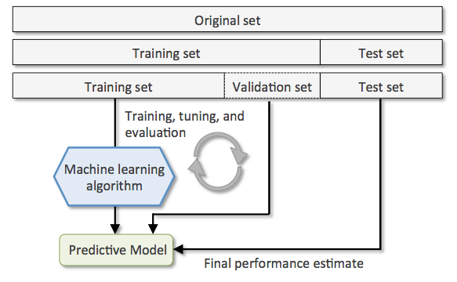
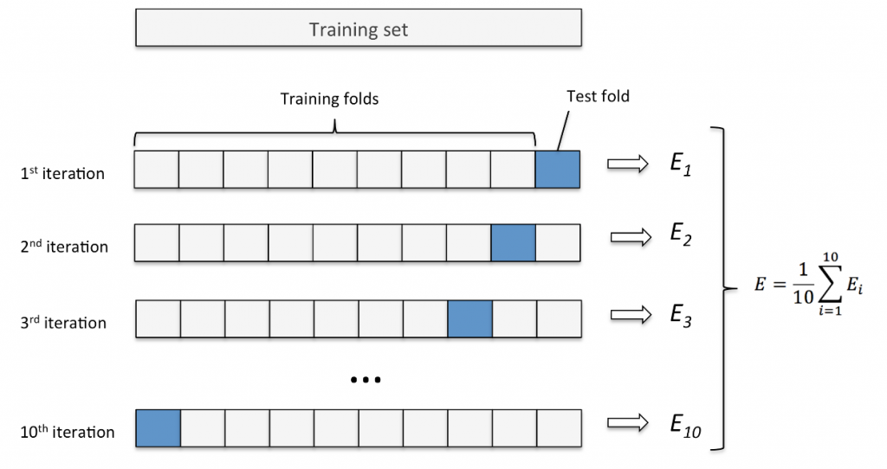

中文名稱：交叉驗證  
英文名稱：Cross-Validation

# 📌 定義（Definition）
交叉驗證是一種用來**評估機器學習模型表現**的方法。它把資料分成多個小部分，輪流用其中一部分當測試資料，其他部分當訓練資料，這樣能夠更準確地了解模型在新資料上的表現，避免模型只在原來的資料上表現好，但對未知資料效果差。

# ⭐原理與技術
交叉驗證的基本想法是將資料集平均分成 K 份（稱為**K折交叉驗證**，k-fold），例如 5 折或 10 折。模型會被訓練 K 次，每次用 K-1 份資料訓練，用剩餘的一份資料做測試，最後將 K 次測試的結果平均化做為模型的整體表現。這樣能降低因資料切分不同造成的評估誤差，使評估結果更穩定和可靠。

使用交叉驗證能有效的解決[過擬合（Overfitting）](過擬合（Overfitting）.md) 的問題

## 方法
K-fold ( K 折 ) 交叉驗證是一種常見的交叉驗證方法，目標能夠準確估計模型的泛化能力，在實做這個方法前，我們會先把拿到的資料集 ( Original set ) 分成訓練集 T1 ( Training set ) 和測試集 ( Test set )，再將訓練集 T1 切分成訓練集 T2 和驗證集 ( Validation Set )，會基於這兩者做模型訓練、評估與參數調整，最後再用測試集評估模型的最終性能表現。

然後我們會讓訓練集 T2 切分成 K 個子集，其中一個子集作為驗證集 ( Test fold ) 測試，剩下的 K - 1 個子集當訓練集 ( Training folds ) 訓練，這樣的過程重複 K 次，每次都輪流讓不同的子集當驗證集，剩下當訓練集並求出模型的性能分數，如此我們就能掌握模型在不同訓練資料下的表現，把 K 次模型的性能分數平均起來就能夠得到模型的平均性能分數 ( Mean Validation Score )。

# 🔗 應用領域
- 機器學習模型評估
- AI 產品開發中的模型優化
- 資料科學中模型選擇和參數調整
- 任何需要驗證模型泛化能力的領域，如醫療診斷、金融風險評估、圖像辨識等

# 3 題模擬練習題

1. 交叉驗證的主要目的是什麼？  
A) 增加訓練資料數量  
B) 評估模型在新資料上的表現  
C) 減少資料收集成本  
D) 提高模型的計算速度  
**答案：B**  
**詳解：** 交叉驗證透過多次分割訓練與測試資料，來評估模型在未見過資料上的泛化能力，而非增加資料數量或加快速度。

2. 以下哪一項不是交叉驗證的步驟？  
A) 將資料分成多個子集  
B) 在每個回合用一個子集做測試，其餘做訓練  
C) 每次測試後丟棄該次模型並重新開始  
D) 將所有回合的測試結果平均來評估模型  
**答案：C**  
**詳解：** 交叉驗證過程中，模型在每折都重新訓練，但不是把模型訓練好的結果丟棄當作無用，而是保存各折的評估結果用來整體評估。

3. 一般常見的 K 折交叉驗證中，如果 K 值選擇太大（例如接近資料筆數），可能會導致什麼問題？  
A) 訓練時間減少且模型效果差  
B) 訓練時間增加且模型評估結果較不穩定  
C) 測試資料不足，無法評估模型  
D) 模型無法完成訓練  
**答案：B**  
**詳解：** K 越大，訓練次數越多，訓練時間增加；雖然可以更接近每筆資料都被測試，但評估的變異性可能增加，導致結果較不穩定。常見折數如5或10折是較好的折衷。

如果需要，我可以幫你轉成更簡短的版本或加入範例。

### role::user

