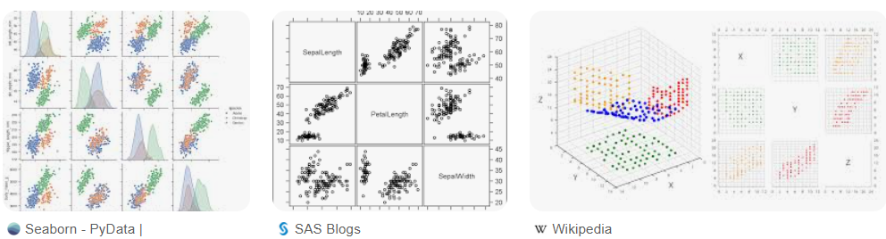
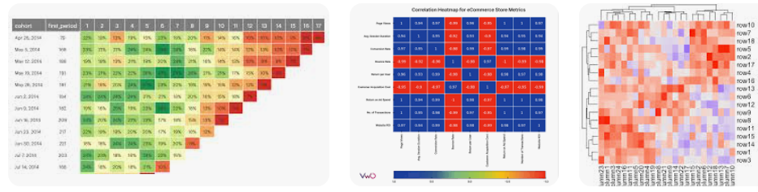

中文名稱：探索性分析 
英文名稱：Exploratory Analysis
# 📌 定義（Definition）
探索性分析是一種數據分析方法，旨在無需預設假設的情況下，透過**多角度探索數據，發現其中的模式、關聯和異常**，為後續的深入分析或建模提供基礎。
通常在研究初期，對資料特徵尚不熟悉的情況下進行，為後續更深入的分析奠定基礎。 
# ⭐原理與技術

以下為探索性分析相關重要觀念：
- **散佈圖矩陣（Scatter Plot Matrix）**
  - 用途：展示**多個變量兩兩之間相關性**，適合高維數據初步探索。
  - 技術補充：可輔以相關係數標註，快速判斷變量間線性關係強弱。
  - 範例：分析銷售數據中價格、數量與地區的互動關係。

- **熱圖（Heatmap）**
  - 用途：用色彩強度展示數據項目間關聯程度，適用**相關分析**或**頻率分布**。
  - 技術補充：常用於相關矩陣視覺化，也適合展示時間序列資料的異動。
  - 範例：了解客戶年齡與消費金額之間的關聯。
  

- **平行坐標圖（Parallel Coordinates Plot）**
  - 用途：展示多維度數據趨勢與模式，便於比較不同觀測值。
  - 技術補充：可利用顏色區分群組，輔助識別資料分群或異常。
  - 範例：比較不同產品的成本、收益及風險指標。

- **箱型圖/盒鬚圖（Box Plot）**
  - 用途：展示數據分佈概況，包括中位數、四分位數及離群值。
  - 技術補充：適合比較多組數據的分布差異，並快速發現異常點。
  - 範例：不同地區收入分佈比較。

- **相關性分析（Correlation Analysis）**
  - 用途：衡量兩變量間線性相關程度，常用皮爾森相關係數。
  - 技術補充：也可用斯皮爾曼等非參數相關係數，適用非線性或非正態資料。
  - 範例：分析廣告支出與銷售收入的相關性。

- **聚類分析（Clustering Analysis）**
  - 用途：將資料分群，組內相似度高，組間差異大。
  - 技術補充：常見方法有 K均值、層次聚類、DBSCAN；適合市場分群、客戶分類。
  - 範例：根據消費行為將客戶分為高價值與一般客戶。

- [**主成分分析**](主成分分析（PCA）.md)（Principal Component Analysis, PCA）**
  - 用途：降維處理，保留主要變異成分，便於視覺化及後續分析。
  - 技術補充：透過特徵值分解或奇異值分解(SVD)計算主成分。
  - 範例：簡化多維銷售數據，發現核心指標。

- **異常檢測（Anomaly Detection）**
  - 用途：識別不符合預期的異常點或罕見模式。
  - 技術補充：方法包括統計方法、機器學習（如孤立森林、局部異常因子LOF）。
  - 範例：偵測金融交易詐騙行為。

# 🔗 應用領域
- **市場行銷分析**：客戶分群、行銷效果評估、消費行為洞察。
- **金融風控**：異常交易偵測、信用評分、風險管理。
- **醫療健康**：病患分群、病症模式探索、醫療數據異常檢測。
- **製造業**：品質控制、設備故障預測、產線效率分析。
- **社會科學**：人口統計分析、行為模式研究、政策影響評估。
- **電子商務**：推薦系統優化、用戶行為分析、庫存管理。

# 3 題模擬練習題

### 題目 1  
下列何者不是探索性資料分析（Exploratory Data Analysis, EDA）常用的視覺化工具？  
A. 散佈圖矩陣（Scatter Plot Matrix）  
B. 熱圖（Heatmap）  
C. 決策樹（Decision Tree）  
D. 箱型圖（Box Plot）  

**答案：** C  
**解析：** 決策樹屬於監督式學習模型，不屬於探索性資料分析的視覺化工具。散佈圖矩陣、熱圖、箱型圖皆為常用EDA工具。

### 題目 2  
在探索性分析中，主成分分析（PCA）的主要目的是？  
A. 將資料分群  
B. 降低資料維度  
C. 預測未來趨勢  
D. 找出資料中的異常點  

**答案：** B  
**解析：** PCA透過將高維數據轉換成較低維度的主成分，保留大部分變異資訊，便於視覺化與後續分析。
### 題目 3  
異常檢測（Anomaly Detection）技術主要用於什麼情境？  
A. 將資料分群  
B. 找出不符合一般模式的資料點  
C. 建立預測模型  
D. 計算相關係數  

**答案：** B  
**解析：** 異常檢測專注於識別與大多數資料行為不同的異常點，如詐欺交易或設備故障。

### 題目 4
下列何者不適合做為資料分布估計？ 
（A）直方圖（Histogram） 
（B）散布圖（Scatter plot） 
（C）雷達圖（Radar chart） 
（D）四分位數（Quartile）
**答案：** C 
**解析：** 雷達圖主要用於比較多個指標在不同面向的相對大小，例如績效評估、能力分析等。它**不呈現資料的頻率、集中或離散情形**，也無法描述分布形態，因此**不適合做為資料分布估計工具**。

