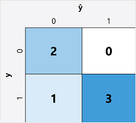
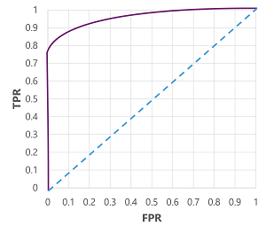

## 混淆矩陣confusion matrix
視覺畫呈現分類模型性能的評估指標，記錄模型的「預測類別」和「真實類別」之間的對應關係。
$ŷ$：預測值，$y$：實際值
- $ŷ=0$ 和 $y=0$ : 確判為假 (True negatives, TN)
- $ŷ=1$ 和 $y=0$ : 誤判為真 (False positives, FP)，偽陽性
- $ŷ=0$ 和 $y=1$ : 誤判為假 (False negatives, FN)，偽陰性
- $ŷ=1$ 和 $y=1$ : 確判為真 (True positives, TP)

## 準確率Accuracy
- (TN+TP) ÷ (TN+FN+FP+TP)  **正確預測量/全部預測量**
- 全部預測數中，正確預測(有病、無病)的數量
- 可能問題：在不平衡的資料中，可能會造成誤導。
- 例如，假設有糖尿病的人只佔總人口的 11%，若一個模型永遠預測一個人沒有糖尿病(ŷ=0)，這個模型什麼都不用判斷，正確率也有89%。

## 召回率Recall = True positive rate (TPR)

- TP ÷ (TP+FN) **確判為真/實際為真**
- 在實際有糖尿病的群體中(確判為有病+誤判為沒病)，預測為有糖尿病的比率。
- 當「漏掉真正的病人」代價極高時，最應關注 Recall，盡量可能降低偽陰性FN。
- 降低「漏檢率」，漏檢=偽陰性。

## 精確度Precision

- TP ÷ (TP+FP) 確判為真/判斷為真
- 在預測有糖尿病的群體中(確判為有病+誤判為有病)，實際上有糖尿病的比率。

## F1分數 F1-score

- (2 x Precision x Recall) ÷ (Precision + Recall)
- 當**數據分佈極度不均**時(如 99.9%都是正常，0.1%異常)，若模型只追求高準確率，會傾向於全部預測維「正常」，導致異常被漏掉。F１分數能更好地評估精確率和召回率之間的平衡。

## 曲線下面積 (Area Under the Curve, AUC)

- True positive rate (TPR)，false positive rate (FPR) = FP÷(FP+TN)
- 變更模型的閾值(threshold)，會影響TPR和TFR，為了評估模型在不同門檻下的整體表現，我們會繪製ROC曲線(received operator characteristic, ROC)，比較所有可能門檻（0.0 到 1.0）下的 TPR 和 FPR 表現。
- 完美模型的 ROC 曲線，會完全貼合沿著TRP向上，再貼著FPR向右。(AUC=1，表示模型100%正確)
- 若ROC曲線是對角線(AUC=0.5)，表示有50%猜對(沒有比隨機猜測好)。

# 3 題模擬練習題