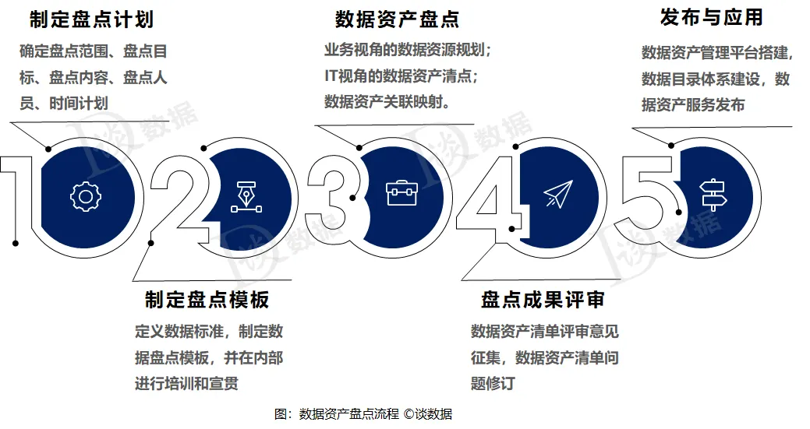

中文名稱：資料盤點  
英文名稱：Data Inventory

# 📌 定義（Definition）  
資料盤點是指系統性地識別、整理、分類和評估組織內所有資料資源的過程。其目的是了解資料來源、內容、屬性、存儲位置以及資料的應用情況，以支援資料治理、資料管理和資料應用等工作。資料盤點有助於提高資料透明度，確保資料合規並優化資料運用效益。

# ⭐原理與技術  
1. 資料辨識原理：透過結構化與非結構化資料的掃描與分析，識別資料資產。  
2. 元資料管理技術：收集並管理資料資源的描述信息（元資料），如資料創建時間、格式、擁有者等。  
3. 自動化掃描工具：利用自動化工具（如資料探勘軟體、資料庫管理系統）進行全面資料搜集與分析。  
4. 資料分類與標籤技術：根據資料敏感度、應用場景等維度進行資料標籤化和分級管理。  
5. 資料質量評估：通過檢查資料完整性、一致性和準確性來評估資料品質。  

# 🔗 應用領域  
1. 資料治理：基礎工作之一，有助於制定資料使用政策與規範。  
2. 法規遵循：支援資料保護法、個資法等合規要求，降低法律風險。  
3. 數據分析與決策支持：提供高質量資料資源，增強分析準確度。  
4. 系統整合與數據遷移：確保資料完整性和一致性，提升整合效率。  
5. 資料安全管理：識別敏感資料，設定適當的存取與保護措施。  

# 3 題模擬練習題  

1. 資料盤點的主要目的不包括下列哪一項？  
A. 確認資料來源與位置  
B. 優化資料運用和管理  
C. 建立資料備份機制  
D. 評估資料品質和敏感度  

詳解：資料盤點的主要目的是確認資料存在的位置、分類、品質及敏感性，提升資料管理及應用效率。建立資料備份機制屬於資料保護範疇，不是資料盤點的核心目的。故答案為 C。  

2. 在資料盤點過程中，以下何者不屬於元資料管理的內容？  
A. 資料創建時間  
B. 資料格式  
C. 資料的複製數量  
D. 資料的擁有者  

詳解：元資料是關於資料本身的描述資訊，如創建時間、格式、擁有者等。資料的複製數量雖為資料特徵，但通常不納入元資料管理的核心範圍。故答案為 C。  

3. 資料盤點有助於滿足以下哪項法律規範的要求？  
A. 勞動法  
B. 個人資料保護法  
C. 競爭法  
D. 環境保護法  

詳解：資料盤點能幫助企業了解並管理個人資料，有助於依據個資法規範保護個人隱私及資料安全。其他選項與資料管理關聯較小。故答案為 B。
