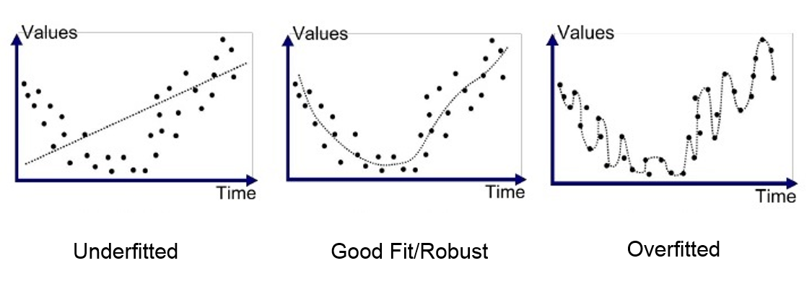

中文名稱：過擬合
英文名稱：Overfitting
# 📌 定義（Definition）
模型在**訓練資料上表現非常好，但在新資料或測試資料上表現很差**的情況。 ^13081e

# ⭐原理與技術
這通常發生在模型過於複雜時，模型不只學到了資料中的整體趨勢，連雜訊與偶然特徵也一併記住了。
直觀來說，過擬合就像是「死背考古題」，對熟悉的題目答得很好，但題目稍微改變就不會了。此時模型的偏差（Bias）低，但變異（Variance）高。

## 常見成因
1. 資料量太少： 樣本不足，模型只能死記        
2. 模型太複雜： 特徵太多、參數太多，連雜訊都學進去
3. 資料品質不好： 含太多異常值、錯誤標記        
4. 訓練太久：   
   模型不斷調整，最後連偶然誤差都當真

## 避免過擬合
1. 增加資料量或多樣性
2. 降低模型複雜度
3. 做資料清洗、去除異常值
4. 使用驗證資料（Validation）
5. 使用**交叉驗證**來選擇合適的模型。
6. 使用**正則化（如 L1、L2）**
7. 進行**特徵選擇**（Feature Selection）
8. 提早停止訓練（Early Stopping）

### 正則化（Regularization）
1. 正則化就是在訓練模型時，**對「太用力學習」這件事加一個剎車**。
2. 在沒有正則化的情況下，模型的目標只有一個：讓誤差越小越好
3. 訓練模型時，實際優化的不是單純的誤差，而是：**原本的誤差 + 懲罰項（正則化項）**
4. 懲罰項會「懲罰參數太大、模型太複雜」
5. [**L1 正則化（Lasso）**](特徵選擇（Feature%20Selection）.md#常見方法：LASSO（L1%20正則化）)
	1. 鼓勵模型： 「能不用的特徵，就不要用。」
	2. 特徵選擇（Feature Selection）
	3. 一些參數會被壓到 **剛好等於 0**，模型自動「刪掉不重要的特徵」
6. **L2 正則化（Ridge）**
	1. 讓所有參數都「變小一點」。
	2. 邏輯是：「每個特徵都可能有點用，但不要有人太誇張。」
	3. 較保守、穩定、泛化能力強

# 🔗 應用領域

# 3 題模擬練習題
## 題目一：判斷是否發生過擬合

某公司訓練一個 AI 模型來預測產品是否不良，結果如下：
- 在訓練資料上的準確率為 98%    
- 在測試資料上的準確率為 62%    

請問最合理的判斷是什麼？
A. 模型泛化能力良好  
B. 模型發生過擬合  
C. 模型發生欠擬合  
D. 資料本身沒有任何問題

**正確答案：B**

**詳解：**  
過擬合最典型的特徵就是：
- 訓練資料表現非常好    
- 一遇到新資料（測試資料）表現明顯變差    

這代表模型「記住了訓練資料的細節」，卻沒有學到可套用到新情境的規律。  
如果是欠擬合，通常連訓練資料的表現都會很差，因此 A、C 不合理；  
僅憑這些資訊，不能直接斷定是資料完全沒問題，所以 D 也不對。

## 題目二：造成過擬合的可能原因

以下哪一個情境**最可能**導致模型發生過擬合？
A. 使用簡單模型並搭配大量且多樣的資料  
B. 模型訓練時間不足  
C. 使用非常複雜的模型，但訓練資料量很少  
D. 在訓練前先進行資料清洗與特徵篩選

**正確答案：C**

**詳解：**  
過擬合通常發生在「模型能力 > 資料支撐能力」的情況下。
選項 C 中：
- 模型很複雜（參數多、彈性大）    
- 資料量卻很少    

模型就容易把偶然出現的雜訊也當成規律學進去，導致只對訓練資料有效。

A 與 D 都是**降低過擬合風險**的做法；  
B 則比較可能導致的是「欠擬合」，而不是過擬合。

## 題目三：降低過擬合的對策判斷

若一個 AI 模型已被確認發生過擬合，下列哪一個作法**最不適合**用來改善？
A. 增加訓練資料的數量與多樣性  
B. 引入正則化（如 L1 或 L2）  
C. 進一步增加模型的複雜度  
D. 使用驗證資料來調整模型參數

**正確答案：C**

**詳解：**  
過擬合的本質是「模型太複雜」，已經學過頭了。
- A：資料變多、變多樣，模型比較不容易死記 → 有助改善    
- B：正則化會限制參數大小、降低模型複雜度 → 有助改善    
- D：使用驗證資料可以避免模型只對訓練資料最佳化 → 有助改善    

只有 C：  
**再增加模型複雜度，只會讓模型更容易記住細節，讓過擬合更嚴重。**